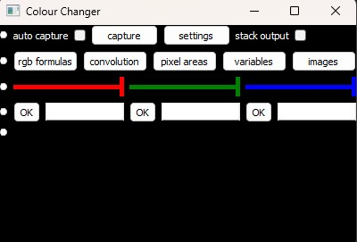

# **Pixel Colour Manipulator**

A colour manipulation sandbox for experimentation, learning and visual effects which ca be applied to videos, images, and screen content.
The app is a Python tool designed for Windows OS which uses a Main window that captures the RGB pixel values under it, applies custom user-defined colour functions and displays the transformed result.

 

**Copyright © 2026 Georg Rashkov** 
 
This project is licensed under the GNU General Public License v3.0 only.
See [LICENSE](LICENSE) for the complete license text.
 
This project uses third-party packages distributed under their own
licenses. See [THIRD-PARTY-NOTICES.txt](THIRD-PARTY-NOTICES.txt) for details.

##

### **Features**

**🧮 User-defined formulas for each RGB channel**

**🌀 Real-time pixel transformation using a configurable timer**

**🎛️ Per-channel convolutional filters**

**🎨 Masks that apply separate formulas to user-defined regions**

**🎥 Works on almost anything placed below the Main window including static content or live video behind the window**

##

### **How it works**

The Main window continuously samples the pixels under it and applies the user-defined formulas to them.

The Main window allows the user to enter formula for each of the RGB channels. Formulas entered by the user are used as a return value from lambda functions. Each lambda function takes as input the parameters `(r,g,b)` where `r` contains the red channel pixel values under the window, `g` contains the green channel pixel values under the window, `b` contains the blue channel pixel values under the window. Each Main window RGB channel has its own lambda function whose return value is defined by the user. The lambda functions look like this:
 
`eval(f"lambda r,g,b: np.stack([ {self.red_func}, {self.green_func}, {self.blue_func} ], axis=-1)")`

The user can use any of the following characters when writing the formula: \[`.` `(` `)` `r` `g` `b` `+` `-` `*` `/` `^` `%` `<` `>` `=` `0` `1` `2` `3` `4` `5` `6` `7` `8` `9`]. When writing the formula the user must use at least once any of the symbols [`r` `g` `b`] so the program can have pixel values to apply transformations. 

Most of the time if the RGB formula has a correct Python syntax the app will consider it as valid. However the app considers as invalid all RGB formulas which have a comparison or arithmetic operator placed before or after another comparison or arithmetic operator. Some symbols are transformed by the app to make them compatible with the Python syntax. The symbol `^` is transformed into `**` while `=` is transformed into `==`. The app will not apply the RGB formulas if the user uses invalid symbols (spaces are ignored but also allowed for readability) or invalid syntax. Here are a few valid formulas: `r-g+100`; `r-g-b*0.2`; `b`, `r>155`; `5^r^g`; `(r-20)*(g-150)`. Here are a few invalid formulas: `r-g+`, `100`, `200-100`, `r**2`. 

Another thing which the RGB formulas rely on is the range of the numbers used inside them. The app uses dxcam to get the pixel values under the Main window and dxcam produces a uint8 numpy array making the formula uncapable of handling values outside the range 0-255 (the app won't crash as it will use the previous working formula). Operation between 2 int values which results in a value outside the range 0-255 (for instance `100*3`, `0-1`) will cause the same problem, however operations between uint8 value and another uint8 value will manage to wrap the result if it is outside the range without throwing errors. Since the input RGB values are represented as numpy array containing uint8 values the app will be able to wrap operations' results outside the range 0-255. If the RGB formula is `200+200+r` the app will not apply it, however if the RGB formula is `200+(200+r)` the app will apply it due to the wraps by numpy.

If you want to know more about the RGB formulas you can check my [RGB_formulas.md](RGB_formulas.md) document.
##

### **Main window widgets**

0) The first element on each line represents a button displayed as a dot which when pressed will remove all widgets on the line. An exception makes the button on the last line which is used to either show the widgets on each line or hide them all.

1) The first line contains elements which control how often the Main window will capture the pixels under itself:
   - when the `auto capture` check box is checked the window will use a frame rate defined by the user in the `settings` window
   - when the `auto capture` check box is not checked the Main window will capture the pixel values only once when the user presses the button `capture` which is useful when the user defined formulas require a computation time over half a second.
   - when the `stack output` check box is checked the window will take as input the RGB values of its own result
   - when the `stack output` check box is not checked the Main window will use as input the RGB values of the pixels under itself

2) The second line contains buttons which open windows providing advanced control over the transformation of the pixel values.

3) The third line contains RGB sliders which allow the user to suppress or strengthen the R, G, B outputs in a simple, fast and smooth way.

4) The fourth line contains text boxes for entering RGB formulas:
   - the first text box determines the RGB formula for the red output channel
   - the second text box determines the RGB formula for the green output channel
   - the third text box determines the RGB formula for the blue output channel

### **Main window additional functionalities**

* The user can freely move the Main window to any point on the screen.

* The user can change the width and height of the Main window to match the size of the region on the screen which the user wants to capture.

* The user can make the window to be click-through by double mouse clicking on top of the window. When the window is click-through the only widgets which will be shown are two buttons (shown as dots) on the top corners of the window. In order to make the window clickable the user will have to press the button on the left corner. The button on the right corner can be used to make the window cover the entire screen excluding the task bar.

##

### **Real time processing**

Whether the app will be able to run in real time will be determined by the user setup.
* User hardware - hardware components such as the CPU and the RAM can determine the overall performance of the app. During the tests the used CPU was `AMD Ryzen 7 2700X` (Physical Cores: 8; Logical Cores/Threads: 16) while the used RAM had a total memory size of 16 GB
* User defined RGB formulas - RGB formulas which contain many arithmetic operations will require more time to process, slowing down performance. Some of the windows for advanced control over the transformation of the pixel values allow the user to enter computationally heavy transformations such as the usage of a convolutional kernel.
* Number of user defined colour transformers - the Main window provides only colour sliders and colour formulas for each RGB channel and since the colours sliders are processed one by one while the RGB formulas are processed at once, the total number of colour transforms which the user can define with it is 4 which shouldn't make a significant frame drop off. However some of the windows for advanced control over the transformation of the pixel values allow the user to enter multiple colour transformers each of which is processed separately from the rest in a defined sequence.
* Total number of pixels to process - the app will not able to run in real time when the total number of pixel values to transform is too much. During the tests the app was able to run in real time when the RGB formulas per colour channel were simple (such as `255-r`) and the pixel values were taken from a region with size up to 1000x1000.

### **Error messages**

All messages created by the app are shown in the terminal. In case you wonder why the app doesn't apply your input you can check the terminal for error messages to find out what was wrong with the input. 

##

### **Requirements**

* Windows OS - confirmed to work on Windows 11
* Python - confirmed to work with Python 3.12
* Virtual python env
* Terminal - tested with Windows PowerShell

##

### Setup hints
- The app setup process and commands were based on Windows 11 OS.
- When running the terminal commands make sure the current working directory is the project's folder.
- If you are not familiar with python you can execute files by running `python path/to/file` where `path/to/file` starts from the current working directory.

### Setup
0) Open the terminal, navigate to the folder where you want the project to be located and execute the following commands

1) Clone the repository
   `git clone https://github.com/GeorgRashkov/Pixel_Colour_Manipulator.git`

2) Navigate to the projects' directory
   `cd Pixel_Colour_Manipulator`

3) Create a virtual python environment (make sure the env's folder is inside the repo)  
   `python -m venv ".venv"`
   - If you have 2 or more python versions and you want to use version 3.12 you should run   
   `py -3.12 -m venv ".venv"`

4) Install the required packages in the env  
   `.venv\Scripts\python.exe -m pip install -r requirements.txt`
   - To reproduce the exact package environment used for the current release, use
     `.venv\Scripts\python.exe -m pip install -r requirements-lock.txt`

5) Run the application 
   `.venv\Scripts\python.exe app/Main_app.py`
